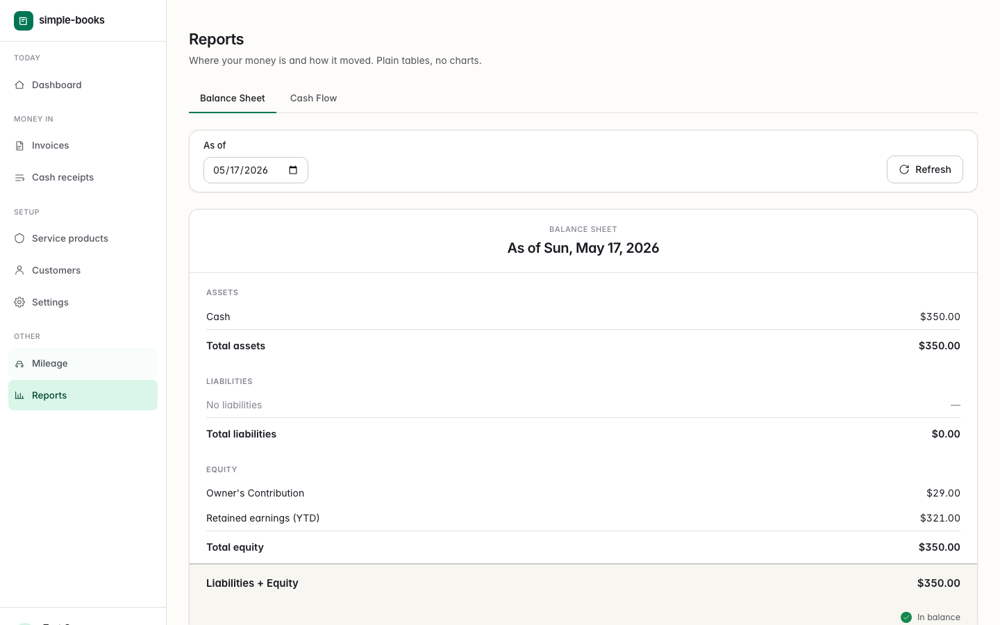
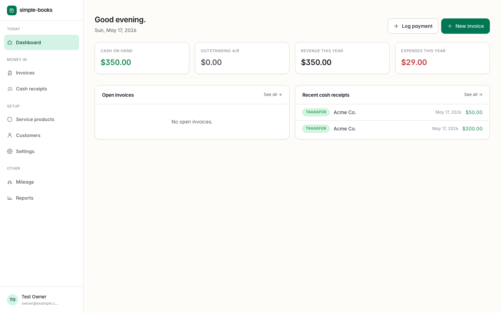
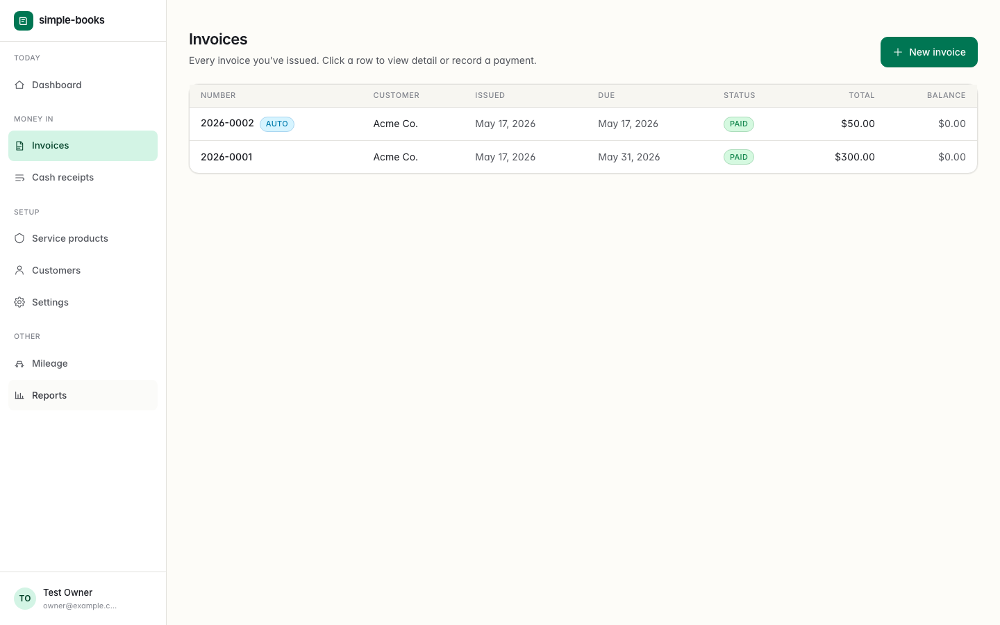
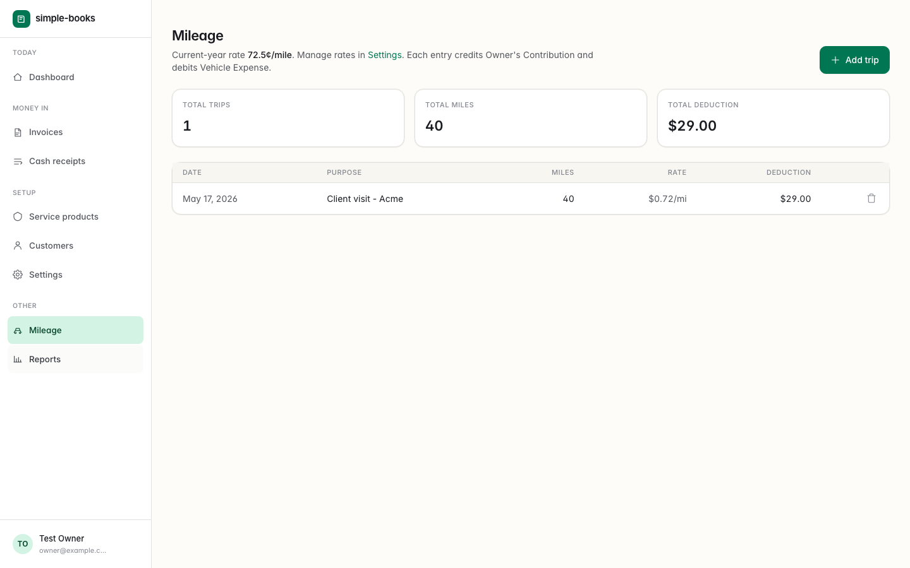
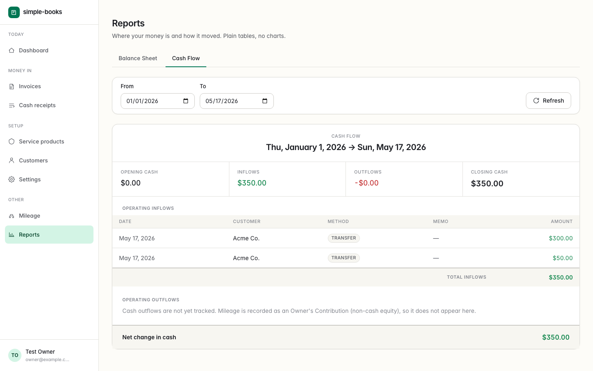

# simple-books

> Calm, real double-entry bookkeeping for sole proprietors who sell services.

`simple-books` is an opinionated MVP built for one person: the owner of a
service business who does not need (or want) QuickBooks. It produces a
*real* set of books — every entry posts to a balanced double-entry journal —
without ever asking the user to read one.



## What it does today (MVP scope)

- **Service products** — what you sell, with a rate per unit (hour, session,
  project…).
- **Customers** — keep it minimal; just enough to attach to invoices.
- **Invoices** — line items, automatic numbering (`YYYY-NNNN`), status
  (open · paid · void). Records only — no email, no payment processing,
  no PDFs in MVP. Edit open invoices with no payments (reverses and
  reposts the journal entry).
- **Cash receipts** — log payments as they come in. If there isn't an
  invoice yet, one is created automatically and the same transaction posts
  it. Method-aware (cash, check, card, transfer, other). Edit payments
  later; stand-alone payments keep the auto-created invoice in sync.
- **Mileage** — record business driving with the IRS standard rates
  (default `$0.725/mile` in 2026); each trip credits Owner's Contribution and debits
  Vehicle Expense. Trips can be edited after the fact.
- **Reports** — Balance Sheet and Cash Flow, rendered as readable tables.
  No charts, by design. Assets always equal Liabilities + Equity.

Behind the scenes every event becomes a balanced journal entry — see
[`DESIGN.md`](DESIGN.md) §5–7 for the data model and posting rules and
[`.agents/skills/accounting-posting/SKILL.md`](.agents/skills/accounting-posting/SKILL.md)
for the engineering recipe.

## Stack

| Layer | Choice |
| ----- | ------ |
| Runtime | **Bun 1.3+** |
| Build | **Vite 8** |
| Server | **Nitro v3** (Bun preset, via `nitro/vite`) |
| App | **TanStack Start** (React 19 + TanStack Router + TanStack Query) |
| Styling | **Tailwind v4** with a custom OKLCH theme |
| DB | **SQLite** (`bun:sqlite`, WAL) via **Drizzle ORM** |
| Auth | **Better Auth** — email/password + generic OIDC plugin |
| E2E | **Playwright** (a single smoke test) |

No Next.js. No Node. No React server components. ESM only.

## Quickstart

```bash
# 1. Install Bun if you don't have it
curl -fsSL https://bun.sh/install | bash

# 2. Install + initialize
bun install
cp .env.example .env
bun run auth:secret   # copy the printed value into BETTER_AUTH_SECRET
bun run db:migrate
bun run db:seed

# 3. Dev server (http://localhost:3000)
bun run dev
```

The very first visit to `/login` will offer to create your **owner** account
— there is only one owner per install. Subsequent visits show normal sign-in
and (if configured) the OIDC button.

### Optional: OIDC provider

Fill in the four `OIDC_*` env vars in `.env`. The discovery URL is built
from `OIDC_ISSUER_URL`. Register the redirect URI as
`<BETTER_AUTH_URL>/api/auth/oauth2/callback/oidc` in your IdP.

**SSO behavior (operators):** When OIDC is configured, successful sign-in
from your IdP will **auto-provision** a new app user if that email is not
already in the database, or **link** the OIDC identity to an existing user
when the email matches (for example the owner who first signed up with
email/password). Access control is entirely through your identity provider
— do not wire up arbitrary “social login” OAuth apps (Google, GitHub, etc.)
unless you intend everyone who can use that client to reach the books.
After the first user exists, additional people should be added in your IdP,
not via public email sign-up.

## Production build

```bash
bun run build      # -> .output/server/
bun run start      # -> bun run .output/server/index.mjs
```

## Smoke test

```bash
bun run db:reset
bun run dev &      # keep running
bunx playwright test --project=chromium
```

The test walks the entire flow and (re)generates the screenshots in
`docs/screens/`.

## Documentation

- [`PROMPT.md`](PROMPT.md) — original task, frozen.
- [`DESIGN.md`](DESIGN.md) — architecture, data model, posting rules,
  security posture, visual design system. The source of truth for design
  consistency.
- [`.agents/skills/`](.agents/skills) — [Agent Skills](https://agentskills.io/)
  (`skill-name/SKILL.md`) for stack, posting, UI, deployment, and testing.

## A tour

| Page                | Screenshot                                    |
| ------------------- | --------------------------------------------- |
| Dashboard           |             |
| Invoices            |              |
| Mileage             |               |
| Balance Sheet       |         |
| Cash Flow           |             |

## License

MIT. See `LICENSE`.
